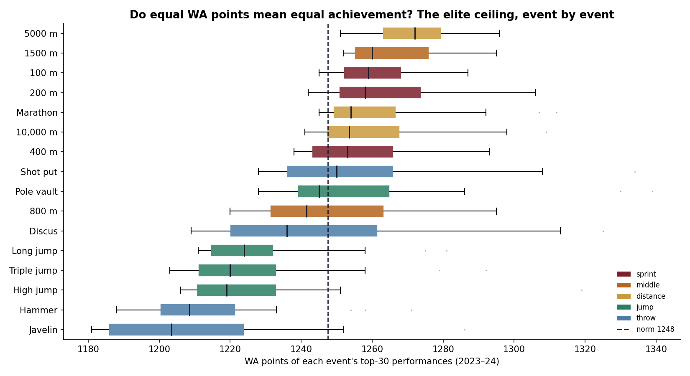
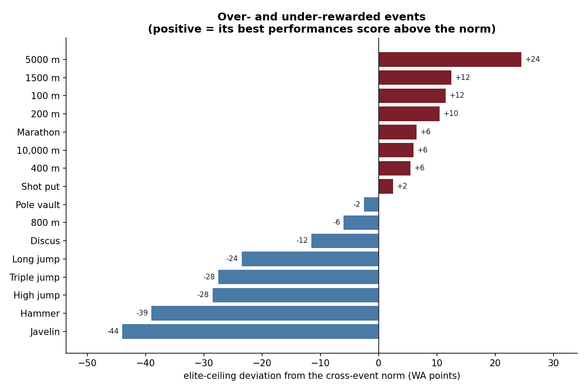

# Auditing the Scoring Tables — Are They Actually Fair?

*The one number that makes all of track & field comparable — put to the test against the global elite.*

## The claim under the whole sport

Track & field runs on a quiet assumption: that the World Athletics scoring tables
are *fair*. A 1200-point shot put is supposed to be exactly as impressive as a
1200-point 100 m, and every cross-event comparison — the decathlon, athlete-of-the
-year, the endless GOAT arguments — leans on that equivalence holding. It's a strong
empirical claim, and one you can test with data the sport publishes itself.

So I scraped the **World Athletics top lists**: for 16 events across 2023–24, the
best ~100 performances each, and — crucially — the **WA points** each one was
awarded. That's **6,400 elite performances**, every one carrying the sport's own
verdict on how good it was. If the tables are fair, the very best performers in each
event should reach roughly the same points ceiling.

## The elite ceiling isn't level

  

They don't. Rank the events by the median WA score of their top-30 performances and
a clear gradient appears: the **5000 m and 1500 m sit highest**, a full **68 points**
above the **javelin and hammer** at the bottom. A Kruskal-Wallis test — the
non-parametric "are these distributions the same?" — rejects equality at
p ≈ 10⁻⁴². The pattern isn't noise, and it isn't random: **running events score
higher at the top than the throws and jumps.** Among today's elite, 1250 WA points
is an unremarkable distance-running season and a near-national-record javelin throw.

  

## What it does — and doesn't — prove

Here's the part most "the tables are broken!" takes skip. An event's elite-score
distribution is driven by **two** things at once: how the table converts marks to
points, *and* how deep and hot the event's current field is. Distance running is in
a golden, deeply contested era; the hammer and javelin are thinner. A perfectly fair
table would *still* show a lower ceiling for a thinly contested event, simply because
fewer athletes are out there pushing its frontier.

So the honest reading is not "the shot put table is miscoded." It's the more
interesting, more defensible claim: **equal WA points do not currently buy equal
standing across events** — and that gap is part calibration, part talent pool. To
cleanly separate the two you'd calibrate each event's table against a fixed frontier
(the world record, say) rather than against who happens to be competing — the natural
next step. But the headline survives: the one number the sport treats as universal
is, in practice, worth measurably more in some events than others.

*Code: [github.com/lyhjeremy/athletics-scoring-fairness](https://github.com/lyhjeremy/athletics-scoring-fairness)*
